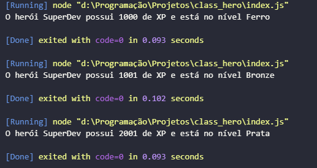

# Class Hero



## Descrição

Este projeto é um exercício básico de lógica de programação da DIO, com o objetivo de praticar o uso de variáveis, condicionais e estruturas de controle em JavaScript.

A aplicação recebe dados de um herói, como nome e quantidade de experiência, e exibe o nível correspondente com base em regras simples de classificação.

## Funcionalidade

O script realiza o seguinte:

- Define o nome do herói;
- Define a quantidade de experiência (XP);
- Classifica o herói em níveis como Ferro, Bronze, Prata, Ouro, Diamante e Imortal;
- Exibe uma mensagem com o nome, o nível e o XP.

## Como rodar

1. Abra o terminal na pasta do projeto.
2. Execute o comando:

```bash
node index.js
```

3. O resultado será exibido no terminal.

## Tecnologias


## O que foi aprendido

Neste projeto, foram praticados conceitos importantes de lógica de programação, como:

- Declaração e uso de variáveis;
- Estruturas condicionais;
- Uso de `switch` e `case`;
- Manipulação de strings com template literals;
- Organização básica de código em JavaScript.

## Autor

Projeto desenvolvido como parte de estudos de lógica de programação.
